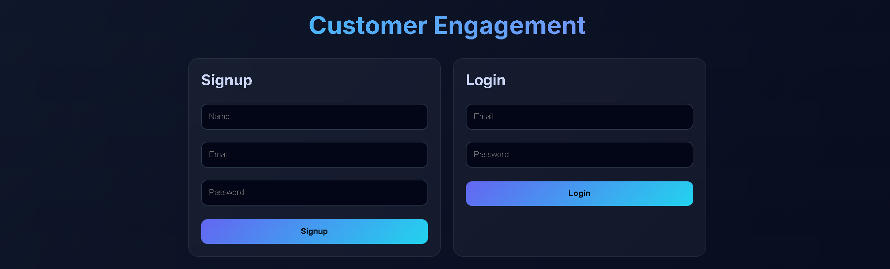
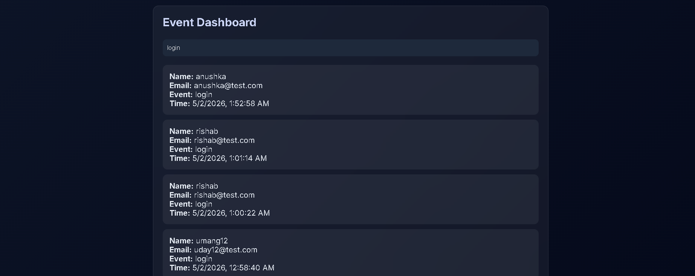
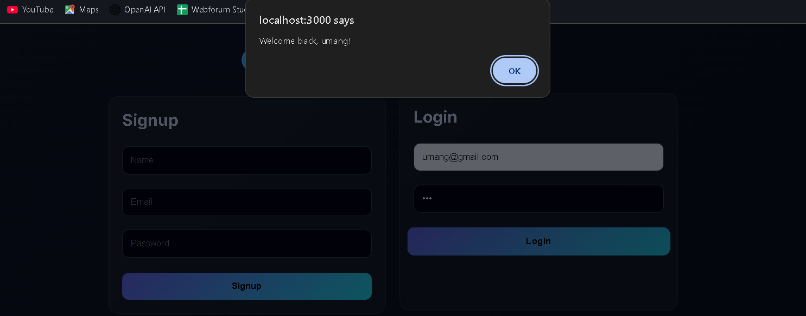

# 🚀 Customer Engagement & Notification System

A full-stack **event-driven customer engagement platform** that tracks user behavior and triggers personalized interactions — inspired by modern tools like MoEngage.
---
---
## 📸 Screenshots

### 🔐 Authentication UI

<p align="center">
  
</p>

---

### 📊 Dashboard (Filtered View)

<p align="center">
  
</p>

---

### 📊 Dashboard (Multiple Events View)

<p align="center">
  
</p>

---

### 🔔 Notification Popup

<p align="center">
  
</p>

---

---

## ✨ Overview

This project simulates how real-world customer engagement platforms work by capturing user actions (such as signup and login) as events and using those events to drive personalized user experiences.

Instead of just building a basic authentication system, this project focuses on:

* Understanding **user behavior tracking**
* Designing **event-driven workflows**
* Visualizing **engagement data in real time**

---

## 🧠 Key Idea

> Every user action is an **event**, and every event can trigger an **engagement action**.

Example:

```
User Login → Event Stored → Trigger Welcome Notification → Dashboard Updated
```

This is the same principle used in real platforms like:

* Marketing automation tools
* Customer engagement systems
* Analytics platforms

---

## ⚙️ Features

### 🔐 Authentication System

* User Signup with hashed passwords (bcrypt)
* Secure Login validation

### 📊 Event Tracking Engine

* Tracks user lifecycle events:

  * Signup
  * Login
* Stores events in MongoDB with timestamps

### 🔗 Relational Data Handling

* Uses MongoDB `populate()` to link:

  * Users ↔ Events

### 📈 Analytics Dashboard

* Displays real-time event data
* Shows:

  * User name
  * Email
  * Event type
  * Timestamp

### 🔍 Filtering System

* Search events by type (e.g., login, signup)

### 🔔 Event-Based Notification

* On login:

  * Displays personalized message
    👉 *"Welcome back, [User]!"*

---

## 🏗️ Architecture

```
Frontend (React)
        ↓
Backend (Node.js + Express)
        ↓
Database (MongoDB)
```

### Flow:

1. User interacts with UI
2. Frontend sends API request
3. Backend processes logic
4. Event is stored in database
5. Dashboard updates dynamically

---

## 🛠 Tech Stack

### Frontend

* React.js
* Axios
* Basic CSS styling

### Backend

* Node.js
* Express.js
* MongoDB (Mongoose)

### Tools

* Git & GitHub
* MongoDB Compass / Atlas
* VS Code

---

## 📁 Project Structure

```
customer-engagement-system/
│
├── backend/
│   ├── models/        → Database schemas (User, Event)
│   ├── routes/        → API routes (auth, events)
│   └── server.js      → Entry point
│
├── frontend/
│   ├── src/
│   │   ├── Signup.js
│   │   ├── Login.js
│   │   ├── Dashboard.js
│   │   └── App.js
│
├── .gitignore
├── README.md
└── .env.example
```

---

## 🔄 How It Works (Step-by-Step)

### 1. User Signup

* User registers
* Password is hashed
* **Signup event is stored**

### 2. User Login

* Credentials verified
* **Login event is created**
* Personalized message triggered

### 3. Event Storage

Each event contains:

* userId
* eventType
* metadata
* timestamp

### 4. Dashboard

* Fetches all events
* Displays them in UI
* Allows filtering

---

## 📸 Screenshots

> 📌 *(Add your screenshots here for better impact)*

* Signup & Login UI
* Dashboard view
* Notification popup

---

## ▶️ Run Locally

### 1. Clone Repository

```bash
git clone https://github.com/UdayKumar0-0/customer-engagement-system.git
cd customer-engagement-system
```

---

### 2. Setup Backend

```bash
cd backend
npm install
npm start
```

---

### 3. Setup Frontend

```bash
cd frontend
npm install
npm start
```

---

### 4. Environment Variables

Create `.env` file in backend:

```
MONGO_URI=your_mongodb_connection_string
PORT=5000
```

---

## 🧠 Concepts Learned

This project demonstrates understanding of:

* REST API design
* Event-driven architecture
* MongoDB relationships (`populate`)
* Authentication & security (bcrypt)
* Frontend–backend integration
* Error handling in async systems

---

## 🚧 Future Improvements

* 📊 Graph-based analytics (charts)
* 🔔 Email/SMS notifications
* 👥 User segmentation
* ⏱ Inactivity-based triggers
* 🌐 Deployment (Render / Vercel)

---

## 💬 Developer Perspective

This project was built to move beyond basic CRUD applications and explore how real systems track and act on user behavior.

It reflects a shift from:

> “Building features”
> to
> “Understanding user journeys and engagement logic”

---

## 🤝 Contribution

Feel free to fork, explore, and improve the project.

---

## 📌 Final Note

This project is a foundational step toward building **scalable customer engagement platforms** and understanding how modern SaaS tools operate internally.

---
